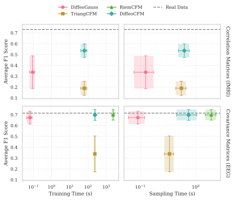

# Riemannian Flow Matching for Brain Connectivity Matrices

Official code for the NeurIPS 2025 paper **“Riemannian Flow Matching for Brain Connectivity Matrices via Pullback Geometry”** ([arXiv:2505.18193](https://arxiv.org/abs/2505.18193)).
It implements diffeomorphism-based flow matching (*DiffeoCFM*) and baselines on the manifold of symmetric positive definite matrices for EEG and correlation matrices for fMRI, with evaluation code for both.

---

## Overview

- Pullback Riemannian geometry to operate on SPD/correlation manifolds with PyTorch implementations of conditional flow matching and Gaussian baseline.
- Data loaders for fMRI (ABIDE, ADNI, OASIS3) and EEG (BNCI2014_002, BNCI2015_001) datasets with automatic downloading of preprocessed data.
- Evaluation scripts based on [EvaGeM](https://github.com/nicolassalvy/EvaGeM) for α-precision/β-recall and Classification Accuracy Scores (CAS) for downstream tasks (disease diagnosis for fMRI, motor imagery for EEG).

---

## Results

Below is the summary of the performance (Average F1 Score) versus computational cost (Training and Sampling time).



This figure should be obtained by following the instructions in the [Quick start](#quick-start) section.

## <a name="quick-start"></a> Quick start

```bash
pip install --upgrade pip
pip install -r requirements.txt
```

To train models and evaluate results, run the following commands:

```bash
python train.py --modality fmri           # ABIDE/ADNI/OASIS3 datasets
python train.py --modality eeg            # BNCI datasets
python evaluate.py --modality fmri        # metrics + figures
python evaluate.py --modality eeg
python plot_summary_figure.py             # summary figure of the results
```

---

## Repository structure

| Path | Role |
| --- | --- |
| `data.py`, `cov_est.py` | Dataset handling and covariance/correlation estimation. |
| `constants.py` | Experiment configuration (datasets, lr, splits, device, etc.). |
| `train.py` | Core training loops. |
| `evaluate.py`, `plot_summary_figure.py` | Metrics and figures. |
| `fm.py`, `gaussian.py`, `diffeo.py` | Models, priors, and diffeomorphisms. |
| `results/`, `figures/` | Auto-created outputs per dataset/group/method. |

---

## Citation

If methods, evaluation or datasets from this repository are useful in your work, please cite:

```bibtex
@inproceedings{collas2025riemannian,
  title     = {Riemannian Flow Matching for Brain Connectivity Matrices via Pullback Geometry},
  author    = {Collas, Antoine and Ju, Ce and Salvy, Nicolas and Thirion, Bertrand}
  booktitle = {Advances in Neural Information Processing Systems},
  year      = {2025},
  url       = {https://arxiv.org/abs/2505.18193}
}
```

---

## License

*   **Project License:** The majority of this repository is released under the **MIT License** and is free for commercial and non-commercial use.
*   **Restricted Component:** The file `spd.py` is adapted from [riemannian-fm](https://github.com/facebookresearch/riemannian-fm) and is licensed under **CC BY-NC 4.0 (Attribution-NonCommercial)**.

**Implication:** If you use this codebase for commercial purposes, you must exclude `spd.py` (and the baseline methods that depend on it, specifically `SPDConditionalFlowMatching` in `spd_fm.py`).

See the `LICENSE` file for full details.
